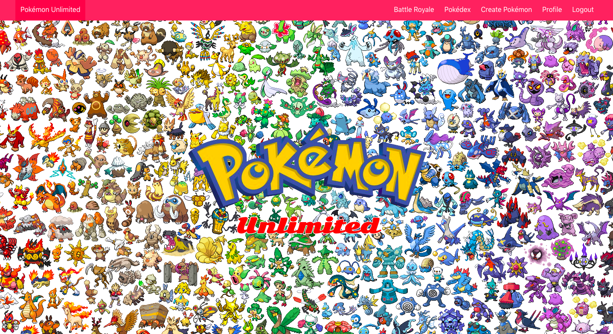
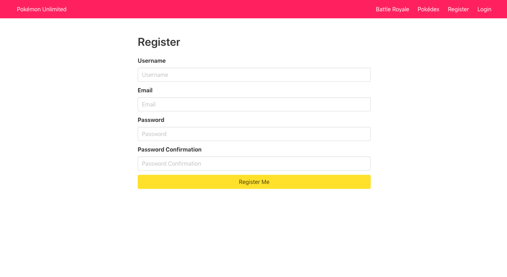
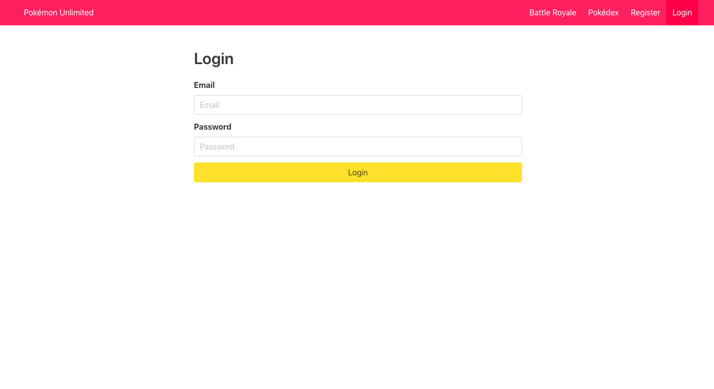
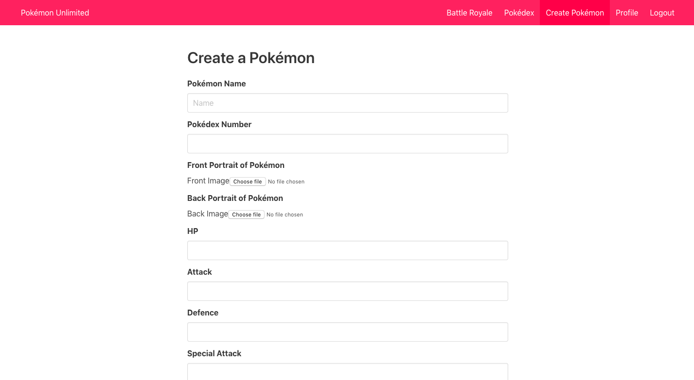
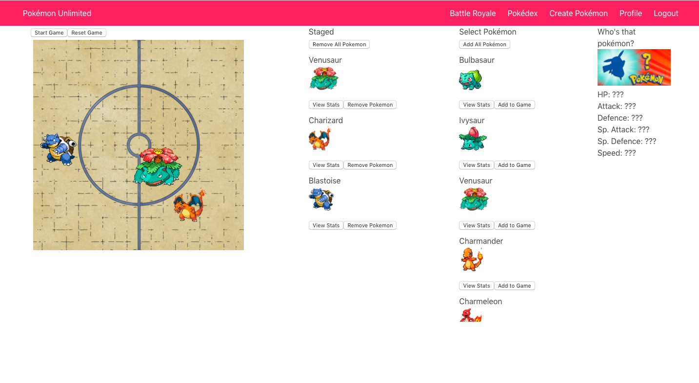
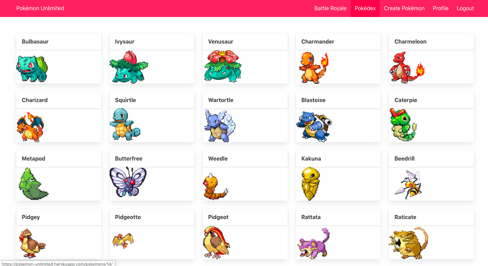
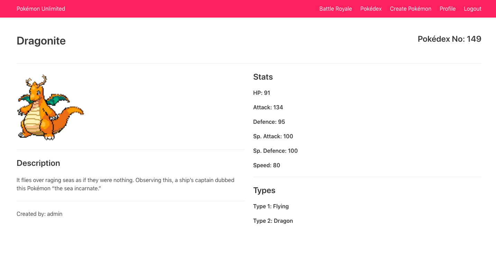

# Pokémon Unlimited

## General Assembly: Software Engineering Immersive - Project 4

[Click here to open the application on Heroku](https://pokemon-unlimited.herokuapp.com/)

## Overview
I was allocated 1 week for my final project at General Assembly. I decided to work solo because I wanted to have a hand in every part of its development. 

Paying tribute to a franchise from my childhood, Pokémon, the project used a database to store user-created Pokémon that could then be implemented into a grid-based game. I wanted to create something that was both fun and complex, testing my abilities and drawing on everything I’d learned so far. 

In the planning phase, I drew relationship models for the backend, specified the components I would need at the frontend, and defined what I wanted to achieve in the game. Each morning, I would write a list of what needed to be done and identify the highest priority features that needed to be implemented first. 

I created the backend database using a Python-based framework called Django and managed it with PostgreSQL. I then installed React, a JavaScript-based framework, for the frontend and used Axios to make database requests. 

## Goal
To create a full-stack Restful application that uses React in the frontend and Django/PostgreSQL in the backend. 

### Timeframe
1 week

### Technologies used
JavaScript, React, Python, Django, PostgreSQL, Axios, Sass, Bulma, Google Fonts, Git, Yarn, GitHub, PokéApi, Cloudinary, Insomnia.

## Instructions
1. To get the most out of this application, you will need to make an account. This will allow you to use all the features of this Restful application such as creating and editing Pokémon. To do this, navigate to the Register page and add your details. You will then be prompted to log in.

2. Next you'll want to create your own Pokémon. Navigate to the create Pokémon tab and fill in the Pokémon's details. Here you can specify the Pokémon's stats, typing, and a host of other attributes. You can add your favourite Pokémon or if you are feeling really creative, try inventing your own! When you are finished, click create and your Pokémon will be added to the database.

3. Now for the fun part! You can use your newly created Pokémon in battle by navigating to the Battle Royale tab. Here the customised stats of your Pokémon will be used to simulate a real-time battle with any other Pokémon you choose. There is a range of default Pokémon here for you to use alongside user-created Pokémon. To add a Pokémon to the game, navigate to the Pokémon using the scroll, click 'Add to game' and it will be added to the 'Staged' area. Pokémon can also be removed from this area with the remove buttons. To quickly view a Pokémon's stats, click the view stats button and a small profile of that Pokémon will appear in the top right corner of the screen. When you are happy with your selection, click 'Deploy Pokémon' and then 'Start Game'. Your selected Pokémon will then do battle! When the battle is over click 'Stop Game' and then 'Reset Game' if you wish to try again. Try experimenting with different types and numbers of Pokémon.

4. You can also discover all the Pokémon on the application by navigating to the Pokédex tab. Here you'll see a snapshot of each Pokémon. Click on its image to view more details about that Pokémon. To easily see all the Pokémon you have created, click on the Profile tab to see a list of them. Again, you can click on a Pokémon to see its details and you have the option to edit or delete that Pokémon. Note: you can only edit/delete Pokémon you have created.

## Development

The development of this application can be divided into three main areas: 

1. The backend database
2. The frontend web application
3. The game logic

Implementing these three features within a 1 week timeframe was very ambitious and subsequently the scope needed to be very focussed, with many features that I would like to have included being shelved for later implementation. However, since finishing the project I have added some polish to the existing features such as improvements to the home page and the Pokédex feature.

### Backend database

I created the backend database using a Python-based framework called Django and managed it with PostgreSQL. It contains two models: one for users and the other for Pokémon. I wanted users to be able to create and edit their own Pokémon so each Pokémon has a user as its owner. I generated the seed file by making Axios requests to [PokéApi](https://pokeapi.co/) for the data I needed. This was actually done at the frontend but users of the application do not have access to this feature. The code is, however, still acessible on GitHub and I can use it to quickly generate additional seeds in future as doing this manually would be very time consuming.

### Frontend web application

I created the frontend using React. I seperated the app into  components to help keep things organised. Requests to the database were made using Axios. I styled the application using Sass and Bulma. I stored the website images in the assets folder but used Cloudinary to store images from the database.

### Game logic

The game logic was the most challenging but rewarding aspect of this application. For the Pokémon to be able to fight in this grid-based game, they needed to be able to be aware of the space they occupied and the space occupied by other Pokémon, detect other Pokémon, choose a target, path-find towards them, attack, calculate damage, and be aware of when they had lost all of their health so that they could remove themselves from the game. I also needed to develop systems for staging and deploying Pokémon from the database into the game. All of this together results in a game that looks very simple but beneath is extremely complicated. To help manage complexity I created this entire aspect of the application in a single component.

## Challenges

The hardest aspect of this project was the extremely limited timeframe that I had to work within. There was a lot to do but for the most part progress went smoothly as I had a clear idea of what I wanted to create before I started working on the application. 

One notable hurdle, however, came with the implementation of using setIntervals to get the Pokémon moving and attacking. Time-based functions in JavaScript do not always behave exactly how I would have expected them to, so getting the Pokémon to behave as I wanted them to took a lot of fine tuning.

## Wins

I was very please to get everything working with no bugs (that I have observed). I was inspired by a humorous [YouTube video](https://www.youtube.com/watch?v=zFqZggMcq34) of Pokémon battling in a free-for-all fashion and I think it's cool that I was able to recreate that. I'm also pleased by the idea of people being able to battle their own unique creations. Pokémon was a big deal for me during my childhood so I enjoyed taking the walk down memory lane that creating this application engendered.

## Future features

- A search and filter feature in the Pokédex and Battle Royale menu
- Fixing the navbar to the top of the screen when scrolling
- Testing in the front and backends
- Generally cleaning up and commenting the code more
- Full user profiles with profile images, bio, etc
- Allow users to add other user's Pokémon to their collections
- Add more Pokémon to the database seed
- Show back sprites on mouse over of Pokémon's image
- Show stats of Pokémon on mouse over in Battle Royale
- Improved visuals and more features in the Battle Royale game:
  - Health bars
  - Sprites change orientation when moving in different directions
  - Ranged attacks
  - Battle audio
  - Animations for attacking
  - Animations for receiving damage
  - Animations for entering and leaving the game
  - A team battle mode
  - A tug of war mode
  - A running commentary of events in the game

## Key learnings

I learned a lot about using Python in the backend and became even more comfortable with React. I made a big effort to avoid repeating code and I think that approach really paid off, allowing me to make a very complicated game that has concise, easy-to-read code with no discernable bugs. I also learned the value of objects in JS, which, to my detriment, I neglected to use in the my first grid-base game in project 1.